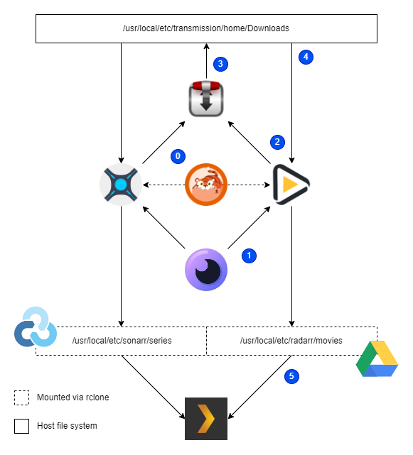

# Media Server


An opinionated Ansible-based media server deployment.

## How It Works




*This role includes [Flemmar](https://github.com/Flemmarr/Flemmarr) to automate the configuration of Servarr applications. Check [flemmarr.yml.j2](./templates/flemmarr.yml.j2) to review and change your settings.*

0. Prowlarr keeps torrent indexes updated
1. User requests movie (or TV show) through Overseerr
2. Radarr (or Sonarr) finds the file and asks Transmission to download it
3. Transmission downloads and seeds it
4. Radarr (or Sonarr) moves the downloaded file to a Rclone mount
5. Plex refreshes its library from the remote mount

## Requirements

All requirements will be installed during execution. This role assumes a fresh FreeBSD 13 installation as a deployment target.

## Role Variables

It is opinionated, remember? No variables.

## Example Playbook

```
- hosts: localhost
  remote_user: root
  roles:
    - role: media_server

```

## To Do

- [ ] Use Jails
- [ ] Documentation

## License

MIT